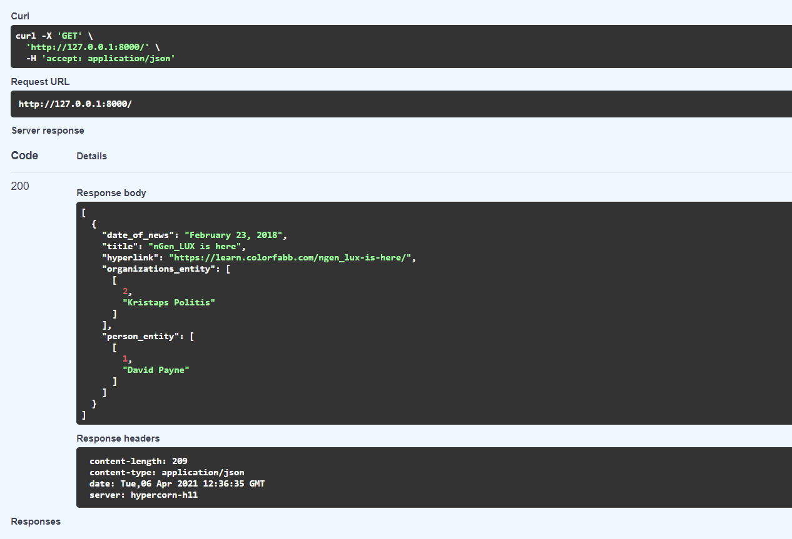

@sarit maitra

## API end-point applications

This is part 2 of 2nd question. I kept the front-end work in a separate repository to avoid cluttering in one repo.

Here I have created end point API apps using FLASK and FAST API.

Both the apps are tested with a small test data enclosed to the programs. However, I do not have a predictive model yet. The apps are based on data modeling and named entity recognition. I have created FAST API which has swagger tool to test the app.

Below screen shot is from Swagger tool.

Creating an API end point won't be that of a complex task provided we have the the necessary data structure available.  

